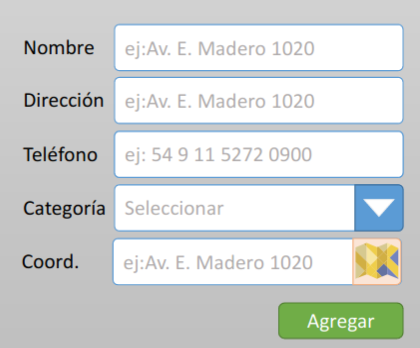

    

    
    
    
    
    
    
    

## Challenge

| Screen | Task |
| ------| ----  |
|  | [Functionality](https://formik.org/docs/overview/) Create a floating or anchored form to create a “Point of Interest”.     :trollface: 35%     |
|  | [Functionality](https://leafletjs.com/SlavaUkraini/examples/quick-start/)  Incorporate a map. The previous point form should be able to add points (or markers) on the map.     :trollface: 25%    |
|  | [Functionality](https://leafletjs.com/SlavaUkraini/examples/quick-start/) These markers (or points (or PoIs)) must have an interactive popup (omaptip) showing: Description, Address, (optional) Telephone, Coordinates     :trollface: 20%    |
